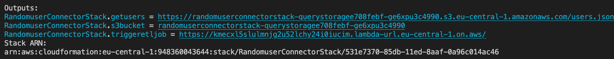
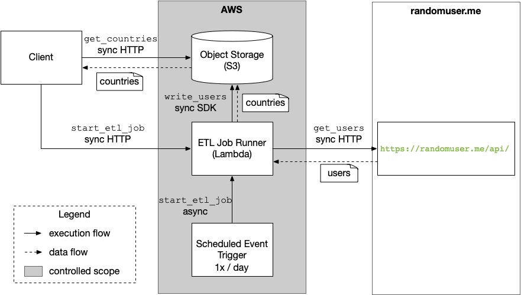

# Randomuser Connector
A connector that periodically extracts user records from [randomuser](https://randomuser.me/api) and provisions an endpoint that allows clients to fetch users records grouped by their country.
The Connector is a serverless system following the IaC paradigm.
It builds on serverless AWS cloud service offers and the AWS CDK for Python.

## Prerequisites
- [Python Python 3.9](https://www.python.org/downloads/)
- [AWS CDK](https://docs.aws.amazon.com/cdk/v2/guide/getting_started.html)
- AWS CLI with default region set to `eu-central-1`

## Project Setup
The `cdk.json` file tells the CDK Toolkit how to execute your app.

This project is set up like a standard Python project.  The initialization
process also creates a virtualenv within this project, stored under the `.venv`
directory.  To create the virtualenv it assumes that there is a `python3`
(or `python` for Windows) executable in your path with access to the `venv`
package. If for any reason the automatic creation of the virtualenv fails,
you can create the virtualenv manually.

To manually create a virtualenv on MacOS and Linux:

```
$ python3 -m venv .venv
```

After the init process completes and the virtualenv is created, you can use the following
step to activate your virtualenv.

```
$ source .venv/bin/activate
```

If you are a Windows platform, you would activate the virtualenv like this:

```
% .venv\Scripts\activate.bat
```

Once the virtualenv is activated, you can install the required dependencies.

```
$ pip install -r requirements.txt
```
Useful commands:

 * `cdk ls`          list all stacks in the app
 * `cdk synth`       emits the synthesized CloudFormation template
 * `cdk deploy`      deploy this stack to your default AWS account/region
 * `cdk diff`        compare deployed stack with current state
 * `cdk docs`        open CDK documentation


## Deployment Instructions
Provision the connector by running:

    cdk deploy

The outputs allow to test and interact with the deployment via two links:


1. `triggeretljob`: manually trigger an ETL job to refresh the user data
2. `getUsers`: get the most current users sorted by country.

You must trigger at least a single ETL job to retrieve data.

Deprovision the connector by running:

    cdk destroy

The S3 bucket is not deprovisioned per default. Hence, it must be deleted manually.

We assume that the target AWS region is `eu-central-1`. The function handler has
a dependency on the Python module `requests`. To reduce the size of the function's deployment package and cold start latency, we inject the dependency via an AWS Lambda layer. To that extent, we use an existing layer available in
the AWS region `eu-central-1`. Check the layer's ARN to another target region. You can retrieve the corresponding ARN for your target region here [LINK](https://github.com/keithrozario/Klayers).

## Development Setup
We developed this app using TDD.
Other developers can setup the project accordingly.
Install development dependencies:

    pip install -r requirements-dev.txt

Add the handler implementation to the virtual environment to allow tests to import them.

    cd lambda/src

    echo $(pwd) > ../../.venv/lib/python3.9/site-packages/etl.pth

    cd ../..

Add the name of the S3 bucket to the OS environment (see output of the `cdk deploy` command `s3bucket`). 

    export BUCKET_NAME=MY_BUCKET_NAME_FROM_CDK_DEPLOY

Run unittests:

    python -m unittest discover lambda/tests


## System Architecture
Figure 1 illustrates the high-level system architecture of the Randomuser Connector.


The ETL Job Runner builds on AWS Lambda. ETL jobs are triggered in two ways.
1. Periodically, i.e., once per day
2. Manually, i.e., calling a the function URL

Per default, the ETL job runner uses three modules:
1. extract
2. transform
3. load
Each module implements the corresponding functionality of an ETL pipeline.

### Extract
(see [module](lambda/src/etl/extract.py))

We extract records from https://randomuser.me/api. Per job, we extract 100 user records for illustration purposes. To increase this limit,
refer to the section `Scalability`. 

We only extract required fields:
- `gender`
- `login` (for *userName*)
- `location` (for *country*)
- `email`

We use 5 retries with an exponential backoff to fetch the records per job.

### Transform
(see [module](lambda/src/etl/transform.py))

### Load
(see [module](lambda/src/etl/load.py))

### Scalability
We discuss how to scale the connector in multiple dimensions.
#### Scale Clients
How does the connector handler larger numbers of clients and requests?
Clients retrieve the results directly from S3. This allows to scale to 5.500 GET requests per second. This should suffice even applications with large user bases.
Hence, no further actions are required.

#### Scale Records
How does the connector handler larger numbers of user records?
The maximum number of user records per request from [randomuser](https://randomuser.me/api) is 5000 records. Implement pagination in the [extract module](lambda/src/etl/extract.py) to increase this limit. Even with pagination, the maximum number of records is (currently) limited by the maximum execution time of lambda functions (15min) and the available instance memory. Vertical scaling of the instance's memory allows larger number of records with minimal changes. To go beyond this limit, we must realize each job as a composition of multiple executions. To this extent, multiple architectural patterns are available, e.g., function chaining and map-style fan-out. Each solution can be realized through orchestration, e.g., using AWS Step Functions, or cheography, e.g., implement a dispatcher function that triggers multiple executions that each load a single page. Additionally, we suggest to store results in multiple files in S3 using an object prefix of the current page, e.g., `/1/users.json`. This allows clients to load single pages and requires minimal changes to the connector. Due to the 3h time limit for the implementation, we did not implement the corresponding solution.

#### Geo-Distribution
How does the connector handler increasingly geo-distributed clients/requests?
First, the app can be deployed in multiple aws regions simulatinously.
Alternatively, general techniques in AWS can be considered, e.g., S3 Acceleration, CloudFront Caching etc.
However, some techniques might require VPC management, and hence break with the existing serverless paradigm of the connector.

#### Organizations
How does the connector handler increasing clients from different organizations?
For a small number of organizations, multiple deployments are feasible and supported out-of-the box that isolate each organization. If necessary, (i) implement access control using IAM or (ii) create temporary magic links in combination with Cognito user management.

#### Data-Freshness
How does the connector handler smaller intervals between ETL jobs?
The connector itself has only soft limits through S3's `PutObject` limit and AWS Lambda's parallel execution limit. Hence, the primary bottleneck are API limits of the data source, i.e., [randomuser](https://randomuser.me/api).
